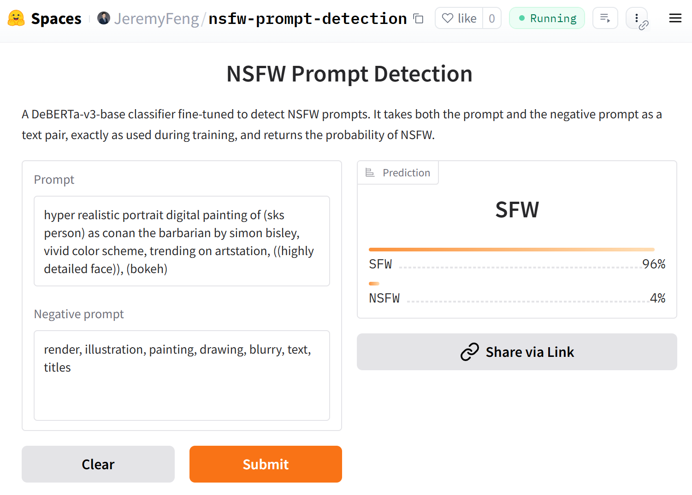
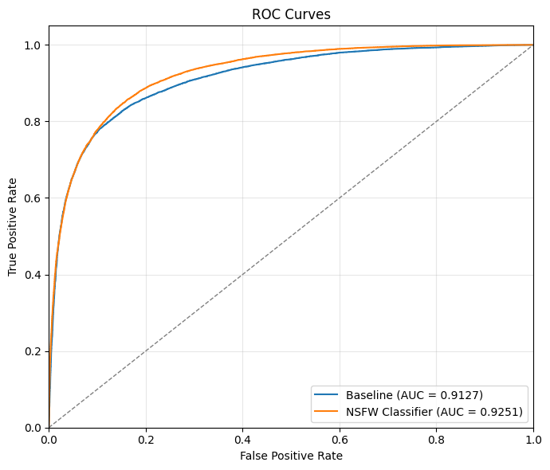
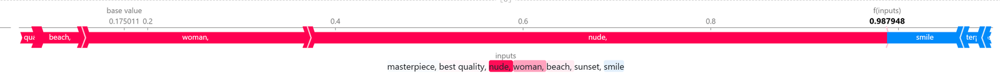

# NSFW Prompt Detection

[](https://huggingface.co/JeremyFeng/nsfw-prompt-detection)
[](https://huggingface.co/spaces/JeremyFeng/nsfw-prompt-detection)
[](https://github.com/astral-sh/ruff)

## Project Overview

- Detects NSFW Stable Diffusion prompts with two tracks: a compatibility-fixed Keras baseline (converted tokenizer/model from the upstream fork) and a fine-tuned DeBERTa-v3 classifier.
- Default data source: Hugging Face `thefcraft/civitai-stable-diffusion-337k`.
- Fine-tuned classifier backbone: `microsoft/deberta-v3-base`.
- Includes ready-made artifacts (`artifacts/label/*.pkl`, `artifacts/pred/*.pkl`) and notebooks for performance and explainability.
- Fine-tuned model weights and an online demo are hosted on Hugging Face: model card at [`huggingface.co/JeremyFeng/nsfw-prompt-detection`](https://huggingface.co/JeremyFeng/nsfw-prompt-detection), Space at [`huggingface.co/spaces/JeremyFeng/nsfw-prompt-detection`](https://huggingface.co/spaces/JeremyFeng/nsfw-prompt-detection).



## Environment Setup (uv)

Python 3.12+ and submodules (`nsfw_prompt_detection_sd`).

```bash
# Install uv
curl -LsSf https://astral.sh/uv/install.sh | sh
# Initialize submodules
git submodule update --init --recursive
# Initialize virtual environment
uv venv
# Activate virtual environment
source .venv/bin/activate
# Synchronize environment
uv sync
```

## Exploratory Data Analysis

- Notebook: [`eda/dataset_overview.ipynb`](eda/dataset_overview.ipynb)
  - Label distribution
  - Token length distribution
  - Word clouds by label

## Training

### Entrypoints (`train/`)

- [`train/baseline_classifier.py`](train/baseline_classifier.py): loads the converted Keras tokenizer/model and scores the test split; writes predictions to `artifacts/pred/pred_baseline.pkl` and labels to `artifacts/label/label.pkl`.
  - Run via uv:
    ```bash
    uv run -m train.baseline_classifier
    ```
- [`train/nsfw_classifier.py`](train/nsfw_classifier.py): fine-tunes DeBERTa-v3; saves preds to `artifacts/pred/pred_nsfw_classifier.pkl` and Hugging Face-style model/tokenizer to `artifacts/model/...`.
  - Run via uv:
    ```bash
    uv run -m train.nsfw_classifier \
      --max_length 384 \
      --lr 0.00001 \
      --num_epochs 20 \
      --warmup_ratio 0.05
    ```
- [`train/nsfw_classifier_resume_training_on_Civitai_2m_prompts.py`](train/nsfw_classifier_resume_training_on_Civitai_2m_prompts.py): continues training with extra data (Civitai-2m for train/val, civitai-337k for test).
  - Run via uv:
    ```bash
    uv run -m train.nsfw_classifier_resume_training_on_Civitai_2m_prompts \
      --train_sample_size 200000 \
      --valid_sample_size 20000 \
      --max_length 384 \
      --lr 0.00001 \
      --num_epochs 20 \
      --warmup_ratio 0.05
    ```

### Data (`data/`)

- [`data/data.py`](data/data.py) defines [`DatasetLoader`](data/data.py#L14) for the default dataset and splits (train/valid/test with stratification).
- Preprocessing rules: strip HTML tags, normalize parentheses, handle weighted tokens `(word:1.2)`, replace newlines/pipes with commas, trim empty segments.

### Models (`model/`)

- [`model/base.py`](model/base.py): abstract classifier interface.
- [`model/baseline_classifier.py`](model/baseline_classifier.py): thin wrapper around the converted Keras assets in `nsfw_prompt_detection_sd/` (`tokenizer.json`, `nsfw_classifier.keras`).
- [`model/nsfw_classifier.py`](model/nsfw_classifier.py): DeBERTa-v3-based classifier with configurable hyperparameters ([`TrainingConfig`](model/nsfw_classifier.py#L25)).

## Evaluation

### Performance

[`evaluate/performance.ipynb`](evaluate/performance.ipynb) (ROC, DeLong’s test for AUC, threshold sweeps).




### Explainability

[`evaluate/explainable.ipynb`](evaluate/explainable.ipynb) (token-level SHAP explanations over comma-separated chunks).


## Inference on the finetuned model

Use the hosted checkpoint on Hugging Face (`JeremyFeng/nsfw-prompt-detection`) without cloning the repo:

```python
import torch
from transformers import AutoModelForSequenceClassification, AutoTokenizer

model_id = "JeremyFeng/nsfw-prompt-detection"
device = "cuda" if torch.cuda.is_available() else "cpu"

tokenizer = AutoTokenizer.from_pretrained(model_id)
model = AutoModelForSequenceClassification.from_pretrained(model_id).to(device)

prompt = "masterpiece, best quality, 1girl, serene landscape, cinematic lighting"
negative_prompt = "low quality, blurry"

inputs = tokenizer(
    prompt,
    negative_prompt,
    return_tensors="pt",
    truncation=True,
    max_length=384,
    padding=True,
).to(device)

with torch.no_grad():
    probs = model(**inputs).logits.softmax(dim=-1)

nsfw_prob = probs[0, model.config.label2id.get("NSFW", 1)].item()
print(f"NSFW probability: {nsfw_prob:.3f}")
```

## License

MIT License.
